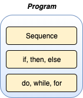
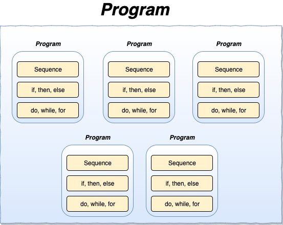

## 2장. 프로그래밍 패러다임

컴퓨터 프로그래밍 패러다임은 크게 구조적 프로그래밍, 객체지향 프로그래밍 그리고 함수형 프로그래밍으로 나눌 수 있습니다. 놀라운 사실은 이 패러다임들이 오래전에 모두 만들어졌다는 것입니다. 개발자들에게는 구조적 프로그래밍, 객체지향 프로그래밍, 함수형 프로그래밍 순으로 인식되고 사용되어 온 것 같습니다. 그 이유는 소프트웨어의 크기와 컴퓨터의 성능 때문이라고 생각합니다. 각 패러다임에서 중요하게 생각했던 내용을 살펴보겠습니다.

### 2-1. 구조적 프로그래밍

구조적 프로그래밍이 주로 사용되던 시절은 컴퓨터 성능이 좋지 않았습니다. 그리고 통신의 속도도 빠르지 않았습니다. 통신 속도가 빠를수록 주고받는 데이터 또는 콘텐츠의 크기도 같이 커지기 마련입니다. 이 시절에는 주로 텍스트를 주고받았습니다. 즉, 프로그램은 작고 단순했습니다. 멀티태스킹이 없던 시절이었습니다. 구조적 프로그래밍으로 구현하는 프로그램을 한마디로 표현하면 아래와 같습니다.

$$
프로그램 = 데이터 + 로직
$$

구조적 프로그래밍의 시작은 다익스트라의 증명으로 시작되었습니다. 다익스트라는 순차, 분기, 반복만으로 모든 프로그램을 만들 수 있음을 증명했습니다. 순차는 프로그래밍 문(statement)이 순서대로 실행됨을 의미합니다. 분기는 if, then, else를 통한 로직 흐름의 방향 제어를 의미합니다. 반복은 do, while, for 등으로 순차와 분기를 반복할 수 있음을 의미합니다.

이 증명이 의미하는 것은 `큰 문제를 작은 문제로 나누어 풀 수 있다.`입니다.



이 프로그램을 아주 가까이에서 들여다보면 아래처럼 `여러 개의 작은 프로그램 또는 모듈`로 구성되어 있을 것입니다.



작은 프로그램 또는 모듈도 순차, 분기, 반복으로 구성됩니다. 작은 프로그램 또는 모듈도 아주 가까이에서 들여다보면 또다시 작은 프로그램 또는 모듈로 나누어집니다. 재귀적으로 계속 들여다보면 결국 더는 쪼갤 수 없는 단위인 순차, 분기, 반복만이 남게 됩니다. 

[분할 정복](https://en.wikipedia.org/wiki/Divide-and-conquer_algorithm) 및 [다이나믹 프로그래밍](https://en.wikipedia.org/wiki/Dynamic_programming)은 큰 문제를 작은 문제로 나누어 해결하는 방법입니다. 다익스트라의 증명에서부터 시작되는 것입니다. 이 증명으로 인해 우리는 함수를 작성할 때 최소 단위로 작성할 수 있게 되었고 최소단위로 구현된 함수들을 모아 규모가 큰 문제를 해결할 수 있는 것입니다.


### 2-2. 객체지향 프로그래밍

객체지향 프로그래밍은 1960년 발표된 시뮬라 67로부터 시작되었지만, 산업계와 개발자들에게 중요하기 인식되기 시작한 때는 1990년대 입니다. 컴퓨터 성능이 좋아지고 GUI가 등장하고 통신 속도가 빨라졌습니다. 인터넷이 보급 되기 시작하고 PC가 대중화 되면서 컴퓨터는 비즈니스만이 아닌 엔터테인먼트를 위한 장치가 되었습니다. 텍스트와 함께 이미지를 포함한 다양한 멀티미디어 콘텐츠를 소비했습니다. 혼자하는 가정용 게임에서 벗어나 함께 하는 온라인 게임으로 점점 이동했습니다. IT산업의 규모가 커지게 되었고 IT기술로 풀어야할 다양한 문제들이 출현하면서 문제의 복잡도가 증가했습니다.

객체지향 프로그래밍을 대표하는 클래스는 로직과 데이터를 담아 아주 작은 모듈을 만들 수 있는 좋은 방법입니다. 그리고 컴퓨터 성능이 좋아지면서 실행시간에 실행할 메서드를 결정하는 동적 바인딩이 문제가 되지 않았습니다. 사람들은 클래스를 잘 활용하면 레고 블록을 조립하듯 프로그램을 개발할 수 있다고 생각했습니다. 레고 블록을 쉽게 교체할 수 있듯이 변경에 쉽게 대처할 수 있어 유지보수에도 탁월하다고 생각했습니다. 객체지향 프로그래밍으로 구현하는 프로그램을 한마디로 표현하면 아래와 같습니다.

$$
클래스 = 데이터 + 로직
$$

$$
프로그램 = 클래스 + 관계
$$

데이터와 로직은 클래스라는 커스텀 타입으로 포장되었습니다. 여러 클래스가 서로 관계를 맺으며 문제를 해결하고 프로그램을 구성합니다. 관계는 클래스들이 서로 메시지를 주고받으며 형성합니다. 

객체지향 프로그래밍은 프로그램을 모듈화하여 개발하는데 아주 좋은 방법입니다. 하지만 프로그램의 규모가 커지면 문제의 복잡도도 동시에 증가합니다. 레고 블록처럼 프로그램을 개발할 수는 있었지만, 유지보수가 쉬워진 것은 아니었습니다. 그 이유는 클래스를 강한 응집력과 약한 결합력을 갖추어 설계하는 게 어려웠기 때문입니다. 이렇게 설계하는 것은 객체지향에 대한 많은 경험을 요구합니다. 그리고 클래스도 타입이고 관계도 클래스 간의 메시지를 주고받으며 형성되는 로직으로 볼 수 있기 때문에 `프로그램 = 데이터 + 로직`이었던 구조적 프로그래밍과 크게 다르지 않습니다. 문제와 복잡도도 증가하면서 유지보수도 어려워졌습니다. 유지보수가 어려운 이유는 여러 가지가 있습니다. 디펜던시도 큰 이유지만 사이드이펙트도 중요한 이유 중 하나입니다. 프로그램 규모가 커지면서 협업을 통한 개발이 일반화되었습니다. 그러면서 사이드이펙트가 커지게 되었죠. 클래스를 만들 때 사이드이펙트를 최대한 줄이고 적절한 테스트를 작성해야 합니다. 그래야 원치 않는 사이드이펙트가 발생한 시점을 알고 대처할 수 있습니다.

### 2-3. 함수형 프로그래밍

함수형 프로그래밍이 주요하게 인식된 것은 근래입니다. 요즘은 1080p를 넘어 4K동영상을 온라인 콘텐츠로 소비하는 시대입니다. PC뿐 아니라 모바일도 싱글 코어가 아닌 멀티 코어가 일반화 되었으며 GPU도 일반화 되었습니다. 동시성뿐만 아니라 병렬성도 대두되었습니다. 개발자가 작성하는 for 루프는 싱글 코어용 코드이지만 프로그래밍 언어가 자체 담고 있는 forEach는 멀티 코어용으로 최적화된 코드입니다. 개발자가 직접 최적화된 for 루프를 만들 필요가 사라졌습니다. 있는 forEach를 그저 사용하기만 하면 됩니다. 마치 HTML의 태그처럼 이미 있는 것을 선언하여 사용하면 그만인 시대가 되었습니다.

수학적 함수와 구조적 프로그래밍에서 사용되는 함수에는 차이가 있습니다. 함수형 프로그래밍은 수학적 함수를 따릅니다. 그리고 구조적 프로그래밍과 객체지향 프로그래밍은 구조적 프로그래밍에서 사용되는 함수를 따릅니다. 그렇다면 둘의 차이가 무엇일까요? 바로 사이드이펙트입니다. 수학적 함수는 순수함수입니다. 순수함수는 사이드이펙트가 없는 함수입니다. 오로지 인자값에만 의존하여 결과값을 만듭니다. 구조적 프로그래밍의 함수는 프로그램의 상태를 변경할 수 있습니다. 글로벌 변수를 변경하기도 하고 객체지향 프로그래밍의 멤버 함수는 this 포인터를 사용하여 멤버 변수의 값을 변경하기도 합니다.

순수 함수는 사이드이펙트가 없어서 함수를 실행해도 외부에 영향을 주지 않아 독립적입니다. 그래서 스레드에 안전하고 병렬로 실행할 수 있습니다. 하지만 구조적 프로그래밍과 객체지향 프로그래밍에서는 함수와 공유 자원의 스레드 안전성은 항상 중요한 주제였습니다.

함수형 프로그래밍이 요즘 와서 대두되는 이유는 함수형 프로그래밍에서 중요한 주제인 불변성(immutable)을 지키기 위해서 많은 메모리와 높은 컴퓨터 성능이 필요하기 때문입니다. 불변성을 지키는 가장 쉬운 방법은 모든 값을 복사하는 것입니다. 예를 들어, 다음 코드를 살펴봅시다. 

```swift
let numberList = [1, 2, 3, 4, 5, 6, 7, 8, 9, 10]

numberList
    .filter { $0 > 5 }
    .map { $0 * 10 }
    .forEach { print($0) }
```

코드를 실행하면 numberList는 filter에 복사되어 전달됩니다. 만약 복사되지 않고 참조나 포인터로 numberList가 전달된다면 filter함수는 외부에 있는 numberList에 의존하는 것이므로 filter 함수는 더 이상 순수 함수가 아닌 것이 됩니다. map 함수에 전달되는 인자도 filter 함수를 통해 나온 결과값이 복사된 것입니다. forEach 함수에 전달되는 인자도 map 함수의 결과값이 복사된 것입니다.

컴파일러 최적화 및 언어 구현 최적화 등을 논외로 할 때, 아주 많은 원소를 가진 리스트를 매번 복사한다면 어떨까요? 많은 메모리와 높은 성능을 갖춘 컴퓨터가 필요할 것입니다. 물론 실제로 이렇게 작동하지는 않습니다. 목록을 한 번에 모두 복사하는 것이 아니라 한 번에 원소 하나씩 복사하면 어떨까요? 원소 1로 $filter \rightarrow map \rightarrow forEach$를 수행하고 다음 원소 2에 같은 작업을 수행합니다. 이렇게 할 때 좋은 점은 멀티 코어를 활용할 수 있다는 것입니다. 만약 10개의 코어를 가진 CPU라면 코어마다 원소 한 개씩 실행하여 최적화를 할 수 있을 것입니다.

순수 함수형 프로그래밍을 지원하는 헤스켈을 제외하면 Kotlin, Swift와 같은 언어들은 모두 멀티 패러다임 언어입니다. 즉, 구조적, 객체지향 그리고 함수형 프로그래밍을 모두 지원합니다. 거인의 어깨 위에 올라앉듯 구조적 또는 객체지향 프로그래밍으로 만들어진 수많은 라이브러리와 프레임워크를 바탕으로 함수형 프로그래밍을 도입하는 것이 좋을 것 같습니다. 함수형 프로그래밍이 대두되면서 개발자들 사이에서 mutable과 immutable 그리고 사이드이펙트가 자주 얘기되는 것 같습니다. 함수형 프로그래밍을 사용하지 않아도 작성하는 함수나 타입이 되도록 불변성을 지키고 사이드이펙트를 낮추는 방향으로 개발하는 것 같습니다.

객체지향 프로그래밍에서 만든 클래스도 타입입니다. 그리고 함수형 프로그래밍에서 함수는 일급 객체로 타입 집합에 속한다고 볼 수 있습니다. 타입은 변수로 선언할 수 있습니다. 

```kotlin
var number: Int = 10
```  

변수가 된다는 것은 어떤 의미를 가질까요? 함수의 인자로 전달될 수 있고 함수의 결과로 반환될 수도 있습니다. 사람의 몸에 피가 흐르듯 변수는 프로그램의 로직을 흐를 수 있습니다. 그러다가 값이 필요하면 변수에서 값을 읽고 새로운 값을 기록해야 하면 변수에 새로운 값을 기록합니다. 

함수가 일급 객체라는 의미는 변수에 함수를 담을 수 있다는 것입니다. 그리고 함수의 인자로 전달되고 함수의 결과로 반환될 수 있음을 의미합니다.

```kotlin
typealias Converter = (Int) -> Int
val triple: Converter = { 
    it * 3 
}
```

인자로 전달한 값을 3배 증가시키는 함수를 triple이라는 변수에 담았습니다. triple은 변수이기 때문에 프로그램의 로직을 흐를 수 있습니다. 그러다가 값이 필요하면 변수에서 값을 읽듯이 triple에 담긴 함수를 실행하여 값을 얻을 수 있습니다. 즉, 기존에는 값만이 변수에 담겨 흐를 수 있었지만, 함수형 프로그래밍에서는 로직이 변수에 담겨 흐를 수 있는 것입니다. 함수형 프로그래밍은 람다를 사용하여 함수를 일급 객체로 만듭니다. 물론 C언어에서 함수 포인터를 사용해서 같은 효과를 만들 수 있습니다. 

```c
#include <stdio.h>

typedef int (*const Converter)(int);

int someConverter(int number) {
    return number * 3;
}

int main() {
    Converter triple = someConverter;
    printf("%d\n", triple(10));
    return 0;
}
```

하지만 람다와 함수 포인터는 큰 차이가 있습니다. 바로 제네릭 지원과 실행을 지연할 수 있다는 점입니다. 람다는 값이 실제로 필요할 때까지 실행을 지연할 수 있습니다. 그리고 제네릭을 아주 쉽게 지원합니다. 그러나 C언어에서 이를 구현하기 위해서는 큰 노력이 필요합니다.

```kotlin
typealias Converter<T> = (T) -> T

fun <T> convert(value: T, converter: Converter<T>): T {
    return converter(value)
}

fun main(args: Array<String>) {
    val input = Scanner(System.`in`)
    val value = input.nextDouble()
    println(convert(value) { it * 10})
}
```

다른 예를 살펴봅시다. 제네릭 함수로 2개의 인자를 더하는 함수를 만들어 봅시다.

```kotlin
fun <T> add(a: T, b: T): T {
    return a + b
}
```

이 함수는 컴파일이 될까요? 컴파일이 되지 않습니다. 제네릭은 타입을 지우는 것이어서 타입 T가 + 연산자를 지원하는지 안 하는지 알 수 없습니다. 이럴 경우 연산 부분에 람다를 적용하면 아주 쉽게 문제를 해결할 수 있습니다. 람다를 구현할 때는 제네릭 타입 T가 구체화되어 있기 때문입니다.

```kotlin
fun <T> add(a: T, b: T, op: (T, T) -> T): T {
    return op(a, b)
}

val result = add(10, 20) { a, b -> a + b }
```

주의할 점은 연산 부분에 람다를 적용한 것입니다. 제네릭 타입을 사용하여 지워진 연산자 내용을 개발자가 람다로 채우는 것입니다. 아래 같은 경우에는 람다를 사용하여도 제네릭과 동일한 문제가 발생합니다. 이럴 경우, 제네릭 타입 T에 타입 제약 등을 적용해 + 연산이 가능함을 컴파일러에 알려줘야 합니다.

```kotlin
fun <T> add(a: T): (T) -> T {
    return { b -> 
        a + b 
    }
}
```

실행지연을 사용하면, [커링](https://en.wikipedia.org/wiki/Currying)을 적용하여 다양한 연산자를 만들 수 있습니다. 두 수를 더하는 함수는 보통 아래와 같을 것입니다.

```kotlin
fun add(a: Int, b: Int): Int {
    return a + b
}
```

[커링](https://en.wikipedia.org/wiki/Currying)을 적용하면 아래와 같이 만들 수 있습니다.

```kotlin
fun add(a: Int): (Int) -> Int {
    return { b -> 
        a + b 
    }
}
```

위 add [커링](https://en.wikipedia.org/wiki/Currying) 함수를 사용하여 연산자를 만들어 보겠습니다.

```kotlin
val op10plus = add(10)
```

그리고 아래와 같이 특정 상황에서 op10plus를 실행하여 원하는 결과를 얻을 수 있습니다. 

```kotlin
fun main(args: Array<String>) {
    val op10plus = add(10) { a, b -> a + b}

    val numberList = listOf(1, 2, 3, 4, 5, 6, 7, 8, 9, 10)
    val result = numberList.map { op10plus(it) }
    println(result)
}
```

[커링](https://en.wikipedia.org/wiki/Currying) 함수에 제네릭을 적용하여 연산자를 만들 수도 있습니다.

```kotlin
fun <T> operator(a: T, op: (T, T) -> T): (T) -> T {
    return { b ->
        op(a, b)
    }
}

fun main(args: Array<String>) {
    val op10plus = operator(10) { a, b -> a + b}

    val numberList = listOf(1, 2, 3, 4, 5, 6, 7, 8, 9, 10)
    val result = numberList.map { op10plus(it) }
    println(result)
}
```

변수 op10plus에 로직을 담아 필요할 때까지 실행을 지연시키고 numberList.map 함수에서 값을 생성하기 위해 사용되었습니다. 람다의 얘기가 좀 길어졌습니다. 람다 이외에도 `함수형 프로그래밍의 함수는 수학적 순수 함수를 따른다`라는 내용이 너무나 중요합니다. 모나드를 이해하는 핵심 열쇠이기 때문입니다. 함수형 프로그래밍으로 작성하는 프로그램을 한마디로 표현하면 아래와 같습니다.


$$
클래스 = 데이터 + 로직
$$

$$
타입 = { 원시타입, 클래스, 함수 }
$$

$$
프로그램 = 타입 + 흐름
$$

타입에 대해서는 많은 얘기를 했지만 흐름에 관해서는 얘기하지 않았습니다. 3부에서 모나드를 알아보면서 '흐름'에 대해서 알아봅시다. 지금까지 컴퓨터 프로그래밍 패러다임을 간략하게 살펴보았습니다. 좀 더 자세하고 재미있는 얘기는 [클린 아키텍처 - 소프트웨어 구조와 설계의 원칙, 로버트 C.마틴 지음](http://www.yes24.com/Product/Goods/77283734?Acode=101) 책에서 읽어보시길 권합니다.

`알림` 이 글은 [데이블 기술블로그](https://teamdable.github.io/techblog/Moand-and-Functional-Architecture)에 올린 글을 제 블로그에 다시 올린 글임을 알려드립니다.