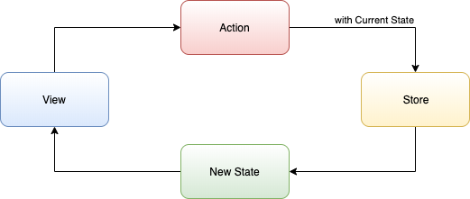
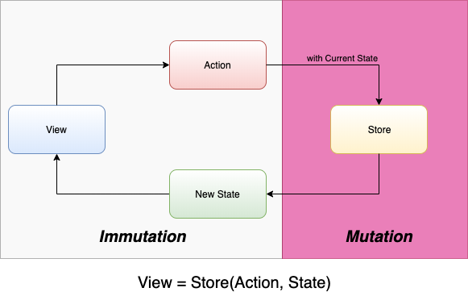

## 5장. 함수형 아키텍처

4부까지 모나드의 개념을 알아보고 몇 개의 간단한 모나드를 구현해 보았습니다. 이런 질문을 가질 수도 있습니다. `이렇게 배운 모나드 개념이 실제로 앱을 개발하거나 웹앱 그리고 백앤드 서비스 등을 만들 때 도움이 될 수 있을까?` 5부에서는 이 질문에 대한 답을 찾아보려고 합니다. 

### 5-1. 프론트앤드 아키텍처

윈도우 운영체제가 GUI 운영체제로 일반 사용자들에게 익숙해져 있을 때, 개발자들은 MFC와 델파이의 VCL 프레임워크를 사용하여 윈도우용 프로그램을 개발했습니다. MFC는 Win32 API를 C++로 추상화한 프레임워크로 마이크로소프트가 개발하였고 VCL은 Win32 API를 Turbo Pascal로 추상화한 프레임워크로 볼랜드가 개발하였습니다. MFC는 Microsoft Foundation Class Library 의미였고 VCL은 Visual Component Library 의미였습니다. VCL은 그 이름답게 컴포넌트 개념을 정말 잘 표현한 라이브러리였습니다. Form이라는 바탕에 각종 컴포넌트를 드래그 앤 드롭으로 배치하고 각 컴포넌트를 서로 바인딩하여 코드 몇 줄만으로도 윈도우 앱을 만들 수 있었습니다. VCL을 만드신 분이 엔더슨 헤즐버그로 볼랜드 이후 마이크로소프트에서 C#과 Typescript를 만드신 분입니다. 

윈도우 앱을 만들 때 많이 사용하던 아키텍처는 MVC 패턴이었습니다. 한동안 MVC 패턴은 프론트엔드 앱을 만들 때 사용하는 아키텍처가 되었습니다. MVC 패턴은 앱의 규모가 작을 때 사용하면 아주 좋은 아키텍처입니다. 왜냐하면 부가적인 코드가 거의 필요치 않기 때문입니다. 정의하려는 클래스가 Model, View 또는 Controller 중 어느 레이어에 포함되는지 구분하여 작성하면 되었고 컨트롤러에서 모델과 뷰를 함께 관리하여 앱을 만들 수 있었습니다. 

시간이 흐르면서 통신의 속도가 빨라지고 콘텐츠의 용량이 커지고 플랫폼이 다양화되면서 앱의 규모는 커지게 되었습니다. 큰 규모의 앱에 MVC를 적용하다 보니 Controller의 규모가 커지게 되었습니다. Controller가 커지면서 자연스럽게 Controller 내부는 View와 Model이 서로 뒤엉켜 의존성을 높이는 결과를 낳았고 이는 유지보수를 어렵게 만들었습니다. 요즘은 MVC를 Massive View Controller 라 부르며 잘 사용하지 않는 아키텍처가 되었습니다. 사람들은 이 문제를 해결하기 위해서 다양한 아키텍처를 개발하게 되었습니다. MVP, MVVM, VIPER 등이 대표적으로 유명합니다. 

이 아키텍처들의 공통점은 레이어 또는 모듈 간의 의존성을 최대한 제거하고 흐름을 단순하게 만드는 것이었습니다. 의존성을 제거하여 테스트를 쉽게 하고 교체를 쉽게 하고 변화에 쉽게 적응할 수 있도록 하는 것입니다. 다양한 아키텍처 중에서 이 글에서는 MVVM과 Redux를 살펴보며 함수형 아키텍처에 대해서 알아보려고 합니다.

#### 5-1-1. MVP

MVVM 아키텍처는 MVP와 함께 모바일 앱 및 프론트 웹앱을 만들 때 많이 사용하는 아키텍처입니다. MVP와 MVVM을 사용하는 의사 코드를 살펴보면서 각 아키텍처를 살펴봅시다.

MVP는 Presenter에서 비즈니스 로직을 수행한 후 결과값을 인터페이스를 통해 View에 전달합니다. MVP는 Presenter에 View에 적용할 인터페이스를 매번 만들어줘야 해서 부가적인 코드가 많이 생성되는 단점이 있고 흐름이 단방향이 아니어서 앱의 규모가 커지면 흐름을 파악하기 어려운 단점이 있습니다. 경험으로는 인터페이스를 만들기 귀찮아서인지 View를 통째로 넘기는 코드도 많이 보았습니다.


```kotlin

interface UpdateView {
    fun updateSomeProperty(value)
}

class View: UpdateView {
    fun updateSomeProperty(value) {
        this.someProperty = value
    }
}

class Presenter {
    fun requestSomeOutput(updater: UpdateView) {
        val output = ... some business logic with models.
        updater.updateSomeProperty(output)
    }
}

controller {
    val view = View()
    val presenter = Presenter()
    presenter.requestSomeOutput(view)
}
```


#### 5-1-2. MVVM

MVVM은 단방향의 단순성 그리고 ViewModel의 출력을 바인딩을 통해 쉽게 사용할 수 있어 MVP보다 많이 사용되고 있는 것 같습니다. View의 속성과 ViewModel의 출력을 바인딩으로 연결해 놓고 ViewModel에 비즈니스 로직을 수행하도록 요청하면 ViewModel은 모델 및 서비스를 사용해 비즈니스 로직을 수행하고 결과를 출력으로 반환합니다. View의 속성과 ViewModel의 출력 바인딩을 통해 View는 자동으로 업데이트됩니다.


```kotlin

class View {
    var someProperty
}

class ViewModel {
    val someOutput
}

controller {
    binding(view.somePropery, viewModel.someOutput) 
    viewModel.requestSomeOutput()
}
```

때로는 단방향이 아닌 양방향 바인딩이 사용되며 바인딩을 위한 코드 숨김이 심할 경우 디버깅이 어려워지는 단점이 있습니다. 맥 OS의 앱을 만드는 Cocoa가 대표적인 예로 양방향 바인딩을 사용하여 IDE 상에서 Model과 View를 양방향으로 바인딩하여 앱을 쉽게 작성할 수 있지만, 그 과정이 너무 숨겨져 있어 디버깅이 어려운 경우가 있습니다. 또한 [안드로이드의 데이터 바인딩](https://developer.android.com/topic/libraries/data-binding/expressions#expression_language)처럼 개발 편의를 위해서 바인딩 표현식에 약간의 로직과 수식을 지원할 때가 있습니다. 이 경우에는 해당 바인딩 표현식에 브레이크 포인터를 설정할 수 없기 때문에 실행 결과를 이해하기 위해서는 반드시 레이아웃 XML 파일을 직접 열고 바인딩 표현식을 읽어 봐야 합니다. 그래도 바인딩은 무척 편리하기 때문에 많이 사용되고 있습니다.

MVVM의 ViewModel을 다시 한번 살펴보면 흐름은 단방향이고 입력을 주면 출력을 반환하며, 바인딩을 통해서 자동으로 출력값이 View에 업데이트됩니다. ViewModel이 함수처럼 작동한다고 느껴집니다. 그러나 MVVM에서는 상태 변경을 항상 ViewModel을 통해서 이뤄지도록 강제하지 않기 때문에 여러 곳에서 상태 변경이 발생할 수 있고 View가 가진 상태값과 ViewModel이 가진 상태값이 다른 경우도 존재했습니다. 

#### 5-1-3. Redux

Flux는 페이스북에서 발표한 아키텍처이며 Redux는 Flux의 구현체로 Dan Abramov가 개발했습니다. Flux와 Redux에는 View, Action, Dispatcher, Store로 구성되어 있습니다. Flux와 Redux가 중요한 이유는 모든 상태를 Store에서 관리하고 Store에서 상태 변경(mutation)이 일어난다는 것입니다.


View는 Action을 Dispatcher를 통해 Store에 보내 비즈니스 로직을 요청합니다. Action을 사용하는 이유는 View가 최대한 약한 결합력을 갖추어 다른 모듈과의 디펜던시를 낮추기 위함입니다. React는 Component를 바탕으로 View를 구성하는 라이브러리로 Component를 최대한 독립적이고 재사용할 수 있게 만들어야 했기 때문에 의존성을 낮추는 것이 꼭 필요합니다. View는 자신이 보낼 Action과 자신을 그리기 위한 데이터만 알면 됩니다. 상태 변경이 항상 Store에서 이뤄지므로 View에는 Action을 보내고 새로운 상태가 오면 자신을 업데이트하는 코드만 있으면 충분합니다. 이를 그림으로 표현하면 아래와 같습니다.



이 그림을 다시 생각해보면 View는 Store에 입력으로 Action과 현재 상태를 전달하고 Store에서 비즈니스 로직 및 서비스를 사용하여 새로운 상태를 만들어 결과로 반환합니다. 그리고 View는 새로운 상태에 반응해 자신을 업데이트합니다. 



즉, Store는 함수가 됩니다. 이를 바탕으로 생각해 보면 Redux로 작성하는 앱은 아래와 같이 표현할 수 있습니다.

$$
App = f \circ f \circ f \circ ... f \circ f \circ f(state)
$$

Redux는 입력과 출력을 Action과 State로 고정하고 Reducer를 통해서 Store에서만 Mutation이 되도록 하여 함수형 아키텍처가 됩니다. 함수형 아키텍처는 함수 합성을 통하여 확장하듯이 앱을 확장합니다. 클라이언트 앱에서 서버는 요청을 보내면 응답을 주는 서비스이며 서버에게 DB는 질의(Query)하면 데이터를 주는 서비스입니다. 모두 입력과 결과로 구성된 함수로 추상화할 수 있습니다.


아주 간단한 구조입니다. Server와 Database에서도 수많은 함수들이 합성되어 시스템을 구성할 것입니다. 함수를 합성하듯이 스택을 구성할 수 있습니다. 

참고로 React Native와 함께 인기를 얻고 있는 [Flutter](https://flutter.dev/docs/development/data-and-backend/state-mgmt/declarative)는 UI를 아래처럼 정의하고 있습니다. 


Apple은 [SwiftUI](https://developer.apple.com/kr/xcode/swiftui/)로 그리고 Google의 Android는 [Jetpack Compose](https://developer.android.com/jetpack/compose)로 Flutter와 React를 닮아가고 있습니다.

### 5-2. ReactComponentKit

[ReactComponentKit](https://github.com/ReactComponentKit/ReactComponentKit)은 iOS 및 Android 앱을 작성할 때, Redux 구조를 사용할 수 있는 아키텍처로 제가 만들고 관리하는 오픈소스입니다. 현재 iOS, Cocoa 그리고 Android 앱을 위한 라이브러리를 각각 제공하고 있습니다.

 * [https://github.com/ReactComponentKit/ReactComponentKit](https://github.com/ReactComponentKit/ReactComponentKit)
 * [https://github.com/ReactComponentKit/AndroidReactComponentKit](https://github.com/ReactComponentKit/AndroidReactComponentKit)
 * [https://github.com/ReactComponentKit/CocoaReactComponentKit](https://github.com/ReactComponentKit/CocoaReactComponentKit)

실례로 안드로이드에서 Room을 사용하여 화면에 임의의 단어 목록을 추가, 삭제하는 앱을 살펴보겠습니다. 전체 코드는 [HelloRoom](https://github.com/ReactComponentKit/HelloRoom)에서 확인할 수 있습니다. 다음은 앱을 실행한 모습입니다. 


#### 5-2-1. Action 

이 예제에서 필요한 Action은 아래와 같습니다.

```kotlin
// DB에서 저장된 모든 단어 목록을 로드합니다.
object LoadWordsAction: Action

// DB에 단어를 추가합니다.
data class InsertWordAction(val word: Word): Action

// DB에서 단어를 삭제합니다.
data class DeleteWordAction(val word: Word): Action
```

#### 5-2-2. Component

Action을 보내는 컴포넌트는 아래와 같습니다.

```kotlin
interface WordProvider {
    val word: Word
}

data class WordModel(override val word: Word): ItemModel(), WordProvider {
    override val componentClass: KClass<*>
        get() = WordComponent::class
    override val id: Int
        get() = word.hashCode()
}

class WordComponent(token: Token): ViewComponent(token) {

    private lateinit var textView: TextView

    override fun layout(ui: AnkoContext<Context>): View = with(ui) {
        val view = include<View>(R.layout.word_component)
        textView = view.findViewById(R.id.textView)
        return view
    }

    override fun on(item: ItemModel, position: Int) {
        val wordProvider = (item as? WordProvider) ?: return
        textView.text = wordProvider.word.word
    }
}
```

이 컴포넌트는 단순히 단어를 화면에 표시만 합니다. 자신이 사용할 데이터 이외에는 이 컴포넌트는 다른 모듈과 디펜던시가 없습니다.

#### 5-2-3. Reducers

각 액션을 받으면 상태를 수정할 Reducer입니다.

```kotlin
// DB에서 저장된 모든 단어 목록을 로드합니다.
fun MainViewModel.loadWords(state: MainViewState): MainViewState {

    val words = WordDB.getInstance(getApplication())
        .wordDao()
        .getAlphabetizedWords()

    return state.copy(words = words)
}

// DB에 단어를 추가합니다.
fun MainViewModel.insertWord(state: MainViewState, action: InsertWordAction): MainViewState {

    WordDB.getInstance(getApplication())
        .wordDao()
        .insert(action.word)

    return state
}

// DB에서 단어를 삭제합니다.
fun MainViewModel.deleteWord(state: MainViewState, action: DeleteWordAction): MainViewState {

    WordDB.getInstance(getApplication())
        .wordDao()
        .delete(action.word)

    return state
}
```

모든 상태 변경 코드는 백그라운드에서 실행되어 Room을 위처럼 사용할 수 있습니다. 그리고 변경된 상태를 WordComponent를 통해 RecyclerView에 표시하기 위해서 WordComponent를 위한 WordModel을 생성합니다.

```kotlin
// Make ItemModels from word list for the recycler view
fun MainViewModel.makeItemModels(state: MainViewState): MainViewState {

    val itemModels = state.words.map { WordModel(it) }

    return state.copy(itemModels = itemModels)
}
```

지금까지 살펴본 Reducer는 단 하나의 책임만 가지고 있어 코드를 파악하기 쉽습니다.

#### 5-2-4. State

예제 앱을 위한 상태를 정의합니다. ReactComponentKit은 Activity, Fragment 또는 UIViewController 마다 State를 관리하도록 했습니다. 그 이유는 Android와 iOS 앱은 React와 달리 Single Page App이 아닙니다. 그리고 같은 화면이 내비게이션 스택에 다른 상태를 가지고 여러 번 등장할 수 있기 때문에 각 화면이 자신의 상태를 갖는 것이 합리적이라고 판단했습니다.

```kotlin
data class MainViewState(
    val words: List<Word> = emptyList(),
    val itemModels: List<WordModel> = emptyList()
): State() {
    override fun copyState(): MainViewState {
        return copy()
    }
}
```

#### 5-2-5. ViewModel

위에서 정의한 상태를 ViewModel에서 관리합니다. ReactComponentKit은 Store와 함께 ViewModel을 사용하고 있습니다. ViewModel은 입력된 Action에 어떻게 반응하는지 기술하고 출력값을 Output으로 관리합니다.

```kotlin
class MainViewModel(application: Application): RCKViewModel<MainViewState>(application) {

    val itemModels = Output<List<WordModel>>(emptyList())

    override fun setupStore() {

        initStore { store ->
            store.initialState(MainViewState())

            store.flow<LoadWordsAction>(
                { state, _ -> loadWords(state) },
                { state, _ -> makeItemModels(state) }
            )

            store.flow<InsertWordAction>(
                ::insertWord,
                { state, _ -> loadWords(state) },
                { state, _ -> makeItemModels(state) }
            )

            store.flow<DeleteWordAction>(
                ::deleteWord,
                { state, _ -> loadWords(state) },
                { state, _ -> makeItemModels(state) }
            )
        }
    }

    operator fun get(index: Int): Word = withState { state ->
        state.words[index]
    }

    override fun on(newState: MainViewState) {
        itemModels.accept(newState.itemModels)
    }

    override fun on(error: Error) {
        Log.e("MainViewModel", error.toString())
    }
}
```

initStore 함수에서 각 액션에 대한 mutation 흐름을 기록해 놓아 코드 파악을 쉽게 하였습니다. 예제 코드에는 없지만, 비동기 mutation을 flow에 쉽게 담기 위해 awaitFlow도 지원합니다. 또한 asyncFlow와 nextDispatch도 지원합니다. 

새로운 상태는 `on(newState:)`메서드로 전달되며 flow를 실행하다 발생한 오류는 `on(error:)`한 곳으로 전달됩니다. MainViewModel은 Action을 인자로 받고 Output 또는 Error를 반환하는 함수로 생각할 수 있습니다.

#### 5-2-6. Controller(MainActivity)

Controller 역할을 하는 Activity의 코드는 아래와 같습니다.

```kotlin
class MainActivity : AppCompatActivity() {

    private lateinit var viewModel: MainViewModel
    private val disposeBag: AutoDisposeBag by lazy {
        AutoDisposeBag(this)
    }

    private val layoutManager: LinearLayoutManager by lazy {
        LinearLayoutManager(this, RecyclerView.VERTICAL, false)
    }

    private val adapter: RecyclerViewAdapter by lazy {
        RecyclerViewAdapter(token = viewModel.token, useDiff = true)
    }

    private val itemTouchHelper: ItemTouchHelper by lazy {
        ItemTouchHelper(SwipeToDeleteCallback {
            val word = viewModel[it]
            viewModel.dispatch(DeleteWordAction(word))
        })
    }

    override fun onCreate(savedInstanceState: Bundle?) {
        super.onCreate(savedInstanceState)
        setContentView(R.layout.activity_main)
        setSupportActionBar(toolbar)

        viewModel = ViewModelProviders.of(this).get(MainViewModel::class.java)

        // 어댑터에 사용할 컴포넌트를 등록합니다.
        adapter.register(WordComponent::class)
        
        recyclerview.layoutManager = layoutManager
        recyclerview.adapter = adapter
        itemTouchHelper.attachToRecyclerView(recyclerview)

        loadWords()
        handleClickEvents()
        handleViewModelOutputs()
    }

    private fun loadWords() {
        viewModel.dispatch(LoadWordsAction)
    }

    private fun handleClickEvents() {
        fab.onClick {
            val word = Word(WordUtils.randomWord)
            viewModel.dispatch(InsertWordAction(word))
        }
    }

    private fun handleViewModelOutputs() {
        viewModel
            .itemModels
            .asObservable()
            .subscribe {
                adapter.set(it)
            }
            .disposedBy(disposeBag)
    }
}
```

MainActivity가 실행될 때, LoadWordsAction을 보냅니다. 그리고 FAB 버튼을 누르면 랜덤으로 단어를 생성하여 InsertWordAction(word)을 보냅니다. 스와이프 제스처를 실행하면 DeleteWordAction(word)을 보냅니다. 각 액션에 대해 ViewModel과 Store가 비즈니스 로직 및 서비스를 실행하여 새로운 상태를 만들고 새로운 상태는 viewModel의 itemModels라는 Output으로 출력되어 RecyclerView를 업데이트합니다. RecyclerView는 내부에서 WordComponent에 WordModel을 전달하여 컴포넌트가 자신을 업데이트할 수 있습니다. ViewModel과 Store에는 Action과 현재 상태가 입력되고 새로운 상태가 출력됩니다. 그리고 Reducer는 잘게 나누어 쉽게 확장이 가능토록 할 수 있습니다. 

### 5-3. 정리

React와 Redux를 네이티브 앱에 도입한 오픈소스 아키텍처는 ReactComponentKit 이외에도 많습니다. AirBnB의 Epoxy와 MvRx 그리고 ReactorKit 등이 있습니다.

 * [https://github.com/airbnb/MvRx](https://github.com/airbnb/MvRx), [https://github.com/airbnb/epoxy](https://github.com/airbnb/epoxy)
 * [https://github.com/ReactorKit/ReactorKit](https://github.com/ReactorKit/ReactorKit)

`알림` 이 글은 [데이블 기술블로그](https://teamdable.github.io/techblog/Moand-and-Functional-Architecture)에 올린 글을 제 블로그에 다시 올린 글임을 알려드립니다.